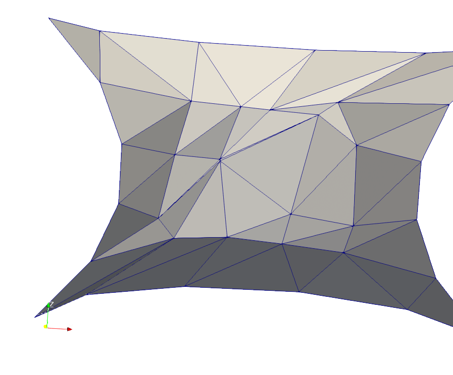
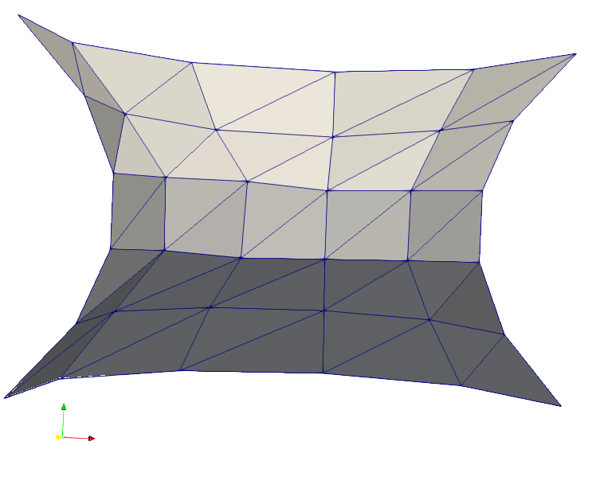

Differential geometry of surfaces
=================================

This is not the usual story of differential geometry.  It is instead
an idiot's guide, using Firedrake_ to allow a fool to stumble through
the calculus of minimal surfaces, eventually reaching
a better understanding and a coherent finite element formulation.

Parameterized surfaces and the area functional
----------------------------------------------

We will work with parameterized surfaces in :math:`\mathbb{R}^3`,

.. math::

  X(s,t) = (x(s,t),y(s,t),z(s,t))

where :math:`x,y,z` are scalar functions, and we assume
:math:`(s,t)\in \Omega \subset \mathbb{R}^2`.  Now, most calculus books
have this simple formula for the area of a surface,

.. math::

  A(X) = \int_{\quad\Omega} \|X_s \times X_t\| \,\mathrm{d} s \mathrm{d} t

where :math:`X_s,X_t` denote partial derivatives of the vector-valued
function :math:`X` and the norm :math:`\|\cdot\|` is the usual (Euclidean)
vector magnitude in :math:`\mathbb{R}^3`.  That is, the area element of
a parameterized surface is
:math:`\mathrm{d} A = \|X_s \times X_t\| \,\mathrm{d} s \mathrm{d} t`,
because the magnitude of the cross product of the tangent vectors
:math:`X_s,X_t` gives the area of the parallelogram they span.

This demonstration will show how to solve for, and plot, parameterized surfaces
which are extremals of this area functional :math:`A(X)`.  We will
solve the Dirichlet problem, a.k.a. Plateau's problem or the soap
bubble problem, subject to boundary conditions

.. math::

  X\big|_{\partial \Omega} = G

where :math:`G(s,t)` is a known function with values in :math:`\mathbb{R}^3`.
In words, the surface :math:`X` spans the wire frame defined by :math:`G`.

Attempt 1: first-variation of the area functional
-------------------------------------------------

To find a minimum we traditionally take a derivative and set it to zero, and
here we compute the first variation of the area functional.

Suppose :math:`X` is a minimizer and suppose
:math:`\Phi:\Omega \to \mathbb{R}^3` is another function such that
:math:`\Phi\big|_{\partial \Omega}=0`.  Then for any
:math:`\epsilon\in\mathbb{R}` the parameterized surface
:math:`X+\epsilon \Phi` spans the same wire frame as :math:`X`.  Define

.. math::

  A(\epsilon) = \int_{\quad\Omega} \|(X_s+\epsilon \Phi_s) \times (X_t+\epsilon \Phi_t)\| \,\mathrm{d} s \mathrm{d} t

Before proceeding observe that
:math:`\|Y \times Z\| = \left[\left(Y\times Z\right)\cdot  \left(Y\times Z\right)\right]^{1/2}`.
Thus we may take the derivative by using the chain rule for the 1/2 power and
the product rules for the cross and dot products.  Also let

.. math::

  N(X) = \frac{X_s \times X_t}{\|X_s \times X_t\|}

be the unit normal tangent field on the surface.  Now compute:

.. math::

  \frac{dA}{d\epsilon}\bigg|_{\epsilon=0} &= \int_{\quad\Omega} \frac{1}{2 \|X_s \times X_t\|} \, \frac{d}{d\epsilon} \left[(X_s+\epsilon \Phi_s) \times (X_t+\epsilon \Phi_t) \cdot (X_s+\epsilon \Phi_s) \times (X_t+\epsilon \Phi_t)\right]_{\epsilon=0} \mathrm{d} s \mathrm{d} t \\
    &= \int_{\quad\Omega} \frac{1}{2 \|X_s \times X_t\|} \, 2 (X_s \times X_t) \cdot \frac{d}{d\epsilon} \left[(X_s+\epsilon \Phi_s) \times (X_t+\epsilon \Phi_t)\right]_{\epsilon=0} \mathrm{d} s \mathrm{d} t \\
    &= \int_{\quad\Omega} N(X) \cdot \left[X_s \times \Phi_t - X_t \times \Phi_s\right] \,\mathrm{d} s \mathrm{d} t

(This reasonably-simple form of the first variation is hard to find in
the literature, but undoubtedly known to e.g. Plateau and Lagrange.)

Thus we have a variational principle, codeable into Firedrake_:

.. math::

  0 = \int_{\quad\Omega} N(X) \cdot \left[X_s \times \Phi_t - X_t \times \Phi_s\right] \,\mathrm{d} s \mathrm{d} t

for all :math:`\Phi` which are zero on the boundary.  As our first, easy
problem we try to compute the catenoid_, a known minimal surface, on a unit
square using :math:`P_1` elements.  Clearly the problem is nonlinear in
:math:`X` so we use the `F == 0` form of `solve()`.

We set up a mesh on :math:`(s,t)` space, build the function space, and
use a flat surface as an initial iterate. ::

  from firedrake import *
  mesh = UnitSquareMesh(5,5)

  V = VectorFunctionSpace(mesh, 'Lagrange', degree=1, dim=3)
  Phi = TestFunction(V)
  s,t = SpatialCoordinate(mesh)
  X = Function(V).interpolate(as_vector([cos(pi*s),sin(pi*s),2*t-1]))

We define the weak form; note that cross and inner products make this easy. ::

  prod = cross(X.dx(0),X.dx(1))
  N = prod / sqrt(inner(prod,prod))
  F = inner(N,cross(X.dx(0),Phi.dx(1)) - cross(X.dx(1),Phi.dx(0))) * dx

The boundary values come from the catenoid_ exact solution. ::

  c = 1.1
  Xexact = Function(V).interpolate(as_vector([c * cosh(2*t-1) * cos(pi*s),
                                              c * cosh(2*t-1) * sin(pi*s),
                                              c * (2*t-1)]))
  bdry_ids = (1, 2, 3, 4)
  bc = DirichletBC(V, Xexact, bdry_ids)

Finally the solve uses PETSc_ SNES for Newton's method and a direct linear
solve (for now). FIXME explain why adjust atol so it converges.  ::

  params = {'snes_type': 'newtonls',
            'ksp_type': 'preonly',
            'pc_type': 'lu',
            'snes_monitor': None,
            'snes_atol': 1.0}
  PETSc.Sys.Print('***** solver attempt 1 *****')
  solve(F == 0, X, bcs = [bc,], options_prefix = 's',
        solver_parameters = params)

We save the solution for viewing with Paraview_.  However, we have to modify
it to remove the base domain for plot using Warp By Vector in Paraview_. ::

  def saveforwarp(X,filename):
      XX = Function(V).interpolate(as_vector([X[0]-s,X[1]-t,X[2]]))
      XX.rename('X(s,t)')
      PETSc.Sys.Print('  writing %s ...' % filename)
      File(filename).write(XX)

  saveforwarp(X,'surface1.pvd')

FIXME using Paraview_ and Surface With Edges see that elements are disappearing

FIXME this is because the area functional is not coercive:
arbitrary reparameterizations of the square :math:`\Omega` will give
the same value

Attempt 2: making the area functional coercive
----------------------------------------------

FIXME just add a laplacian: isothermal coords always exist [Op2000_, theorem 3.4.1]
and parameterizations of minimal surfaces (with zero mean curvature) are
isothermal if and only iff they are harmonic [Op2000_, corollary 3.5.2]

FIXME no longer need to cheat by setting nice initial or stopping iteration early ::

  X = Function(V)
  eps = 1.0
  F = inner(N,cross(X.dx(0),Phi.dx(1)) - cross(X.dx(1),Phi.dx(0))) * dx \
      + eps * inner(grad(X),grad(Phi)) * dx
  params.update({'snes_atol': 1.0e-50})
  PETSc.Sys.Print('***** solver attempt 2 *****')
  solve(F == 0, X, bcs = [bc,], options_prefix = 's',
        solver_parameters = params)
  saveforwarp(X,'surface2.pvd')

FIXME much better

Attempt 3: higher resolution
----------------------------

FIXME I want it high res, e.g. 10^6 elements ... but here for now
has h and p refinement

FIXME this version initializes from exact; the issue is the division by
zero in the functional ::

  mesh = UnitSquareMesh(20,20)
  V = VectorFunctionSpace(mesh, 'Lagrange', degree=2, dim=3)
  Phi = TestFunction(V)
  s,t = SpatialCoordinate(mesh)
  c = 1.1
  Xexact = Function(V).interpolate(as_vector([c * cosh(2*t-1) * cos(pi*s),
                                              c * cosh(2*t-1) * sin(pi*s),
                                              c * (2*t-1)]))
  bdry_ids = (1, 2, 3, 4)
  bc = DirichletBC(V, Xexact, bdry_ids)
  X = Xexact.copy()  # FIXME
  prod = cross(X.dx(0),X.dx(1))
  N = prod / sqrt(inner(prod,prod))
  F = inner(N,cross(X.dx(0),Phi.dx(1)) - cross(X.dx(1),Phi.dx(0))) * dx \
      + eps * inner(grad(X),grad(Phi)) * dx
  PETSc.Sys.Print('***** solver attempt 3 *****')
  solve(F == 0, X, bcs = [bc,], options_prefix = 's',
        solver_parameters = params)
  saveforwarp(X,'surface3.pvd')

Attempt 4: specify the wireframe
--------------------------------

FIXME how to do this?  I.e. what if we do not know a formula for the minimal
surface, from which we can get the boundary conditions? perhaps mesh the disk
and use its boundary as the parameter of a curve

TODO
----

FIXME Print numerical error in L_infty norm; currently ::

  def printerror(X,Xexact):
      Xdiff = Function(V).interpolate(X - Xexact)
      with Xdiff.dat.vec_ro as vXdiff:
          error_Linf = abs(vXdiff).max()[1]
      PETSc.Sys.Print('  error |u-uexact|_inf = %.3e' % error_Linf)
  #printerror(X,Xexact)

FIXME more interesting surface and better visualization
(e.g. with wireframe shown and raytrace to get shiny?)

.. [Op2000] J. Oprea, *The Mathematics of Soap Films: Explorations with Maple*,
   Student Mathematical Library 10, American Mathematical Society 2000.

.. _Firedrake: https://www.firedrakeproject.org/
.. _catenoid: https://en.wikipedia.org/wiki/Catenoid
.. _Paraview: https://www.paraview.org/
.. _PETSc: http://www.mcs.anl.gov/petsc/

